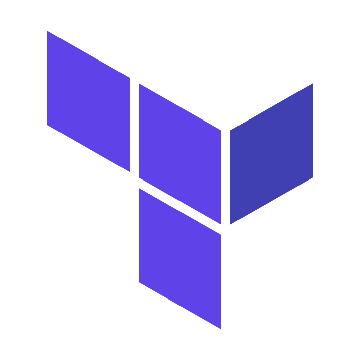

### Hi there, I'm [Navratan Lal Gupta][website] 👋

[][linkedin]
<!--[][linkedin]-->
<!--  -->

## I'm a DevOps Engineer, Developer and a Linux Enthusiast !

- :heart: Linux and :handshake: Open Source Projects
- 🔭 Follow me on Medium for technical articles - [Linux Shots](https://navratangupta.medium.com/).
<!-- 🌱 I’m currently learning GCP.-->
- :zap: I love teaching, travelling, binge-coding and watching movies.
- 🥅 2025 Goals: Get certified as Google Cloud Professional Cloud Architect and Learn AI.
<!--
[comment]: <> (- ⚡ Fun fact: I love to sing and read books)
[comment]: <> (- 🥅 2020 Goals: Learn new programming & speaking language. )
-->

### :handshake: Connect with me:

[][website]
[][Medium]
<!-- [][twitter] -->
[][linkedin]

[comment]: <> ([][instagram])

 

### :1st_place_medal: Certifications and Badges

   

### :gear: Languages and Tools:

<!--  -->

<!--  -->

<!--

[][webdevplaylist]
[][webdevplaylist]
[][webdevplaylist]
[][webdevplaylist]
-->
 
 
 

### :zap: Github Stats

 

 
 
 
 
 
 
 
 
 

 
 
 
 
 
 
 
 
 

### 🕮 Latest Tech articles

<!-- MEDIUM-POST:START -->
- [Encryption of terraform state using OpenTofu](https://medium.com/linux-shots/encryption-of-terraform-state-using-opentofu-04fd9dd2f562?source=rss----4f86df82889f---4)
- [Spin-up a Kubernetes cluster on personal laptop](https://medium.com/linux-shots/spin-up-a-kubernetes-cluster-on-personal-laptop-97a511e28564?source=rss----4f86df82889f---4)
- [Migrate PVC from one storage class to another](https://medium.com/linux-shots/migrate-pvc-from-one-storage-class-to-another-195f1c38e019?source=rss----4f86df82889f---4)
- [Sync Kubernetes secrets with cloud-native secret managers](https://medium.com/linux-shots/sync-kubernetes-secrets-with-cloud-native-secret-managers-e24095472a24?source=rss----4f86df82889f---4)
- [Backup Kubernetes using Velero and CSI volume snapshot](https://medium.com/linux-shots/backup-kubernetes-using-velero-and-csi-volume-snapshot-4155d4e32e5d?source=rss----4f86df82889f---4)
<!-- MEDIUM-POST:END -->

➡️ [more articles...][medium]

---

 
 

<!--
### :zap: Languages Used:

-->

[website]: https://github.com/navilg
<!-- [twitter]: https://twitter.com/navratan_gupta -->
[medium]: https://medium.com/linux-shots
[linkedin]: https://in.linkedin.com/in/navratan-gupta
